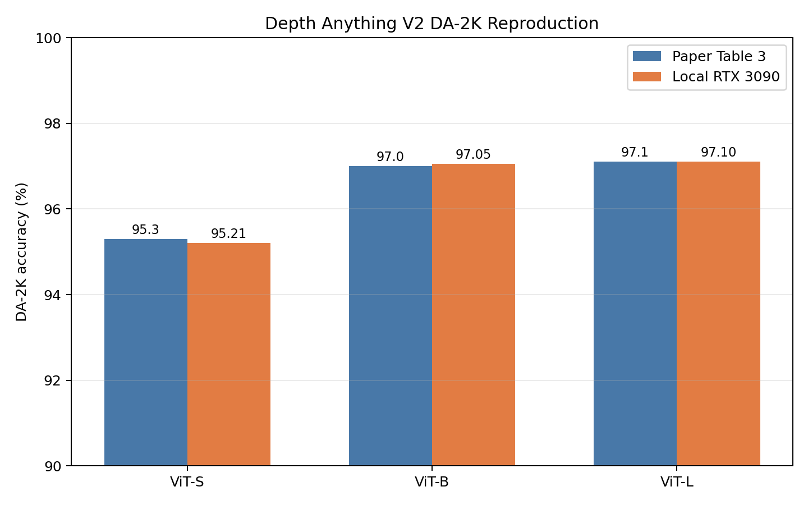
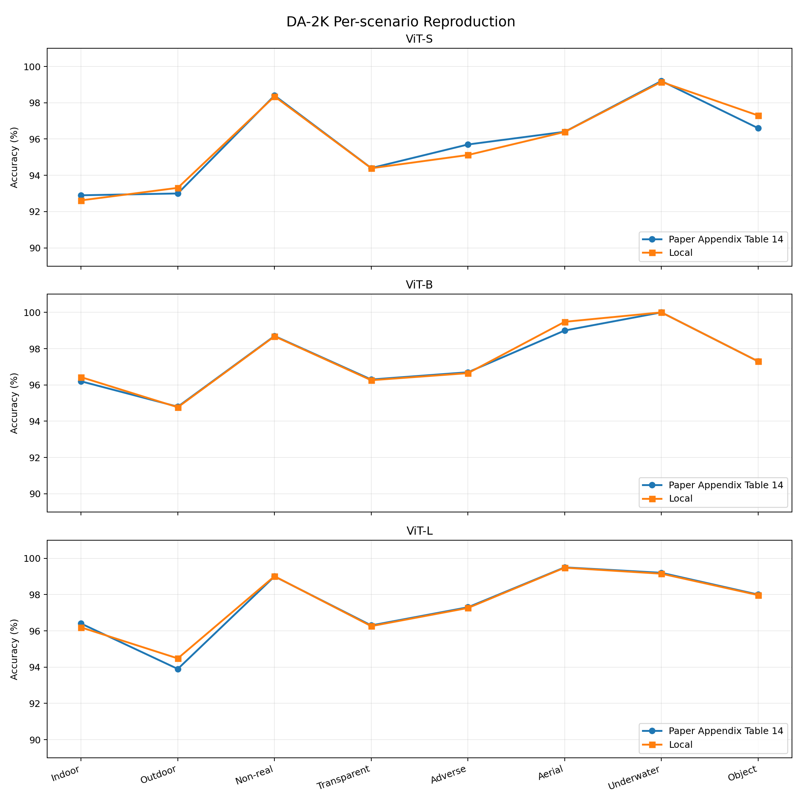
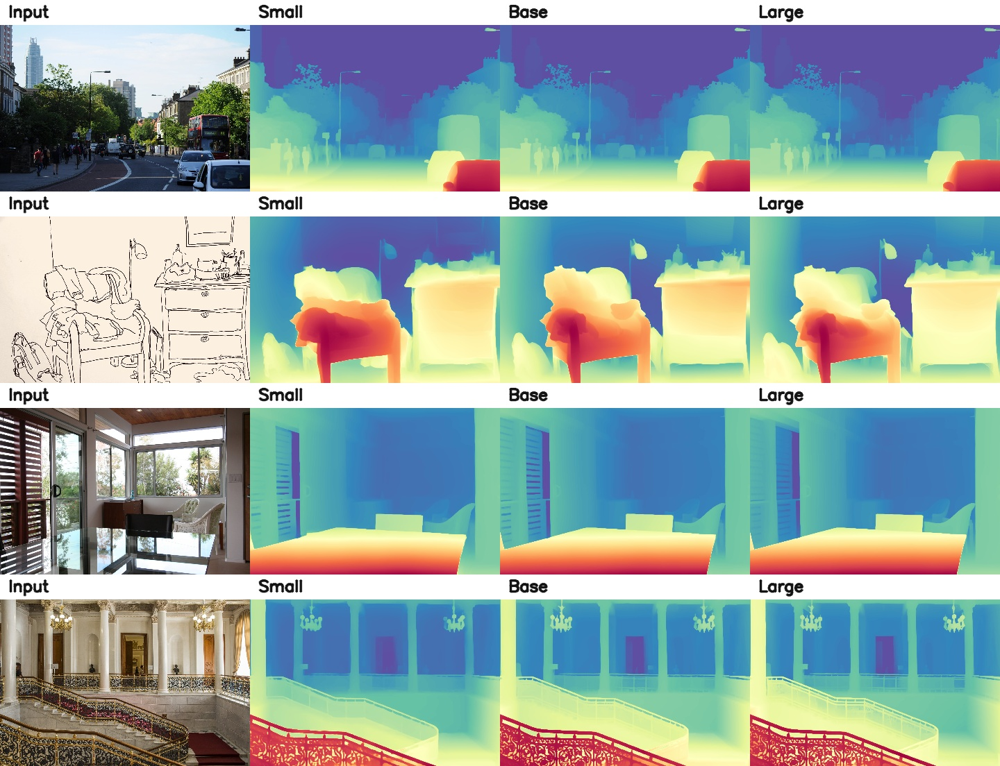
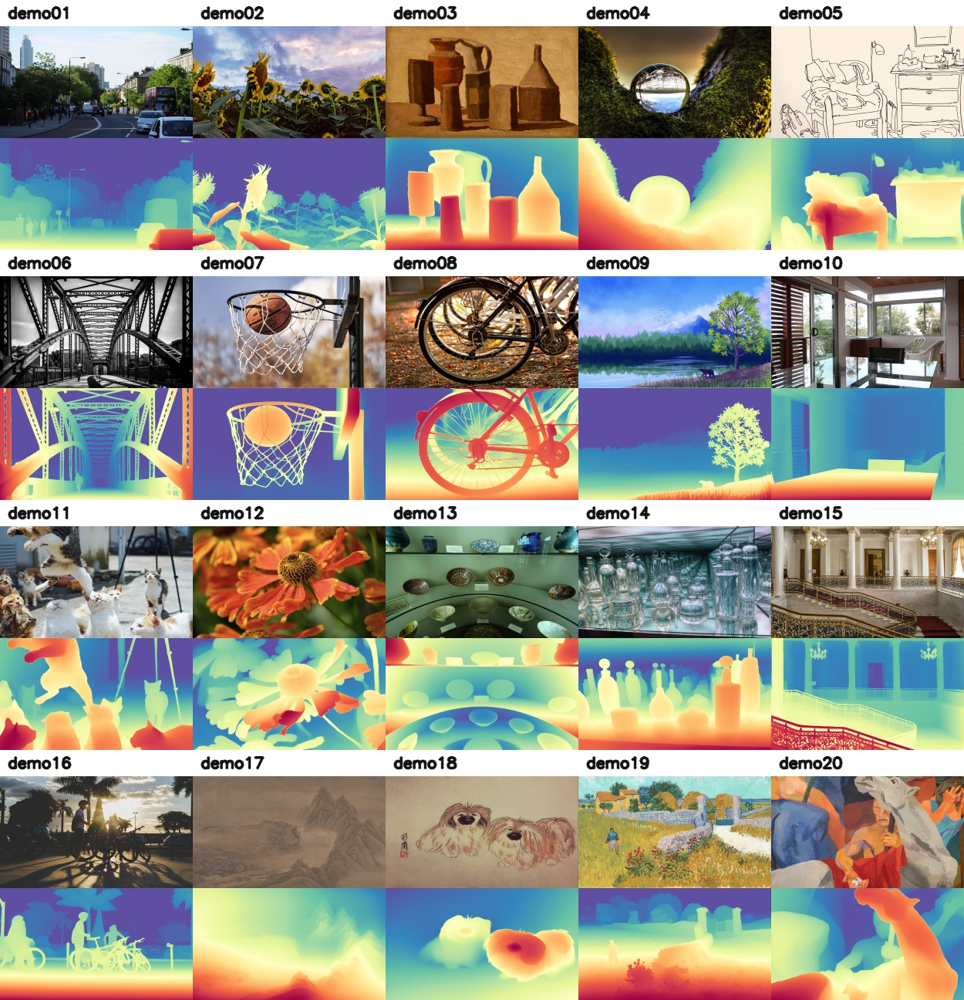
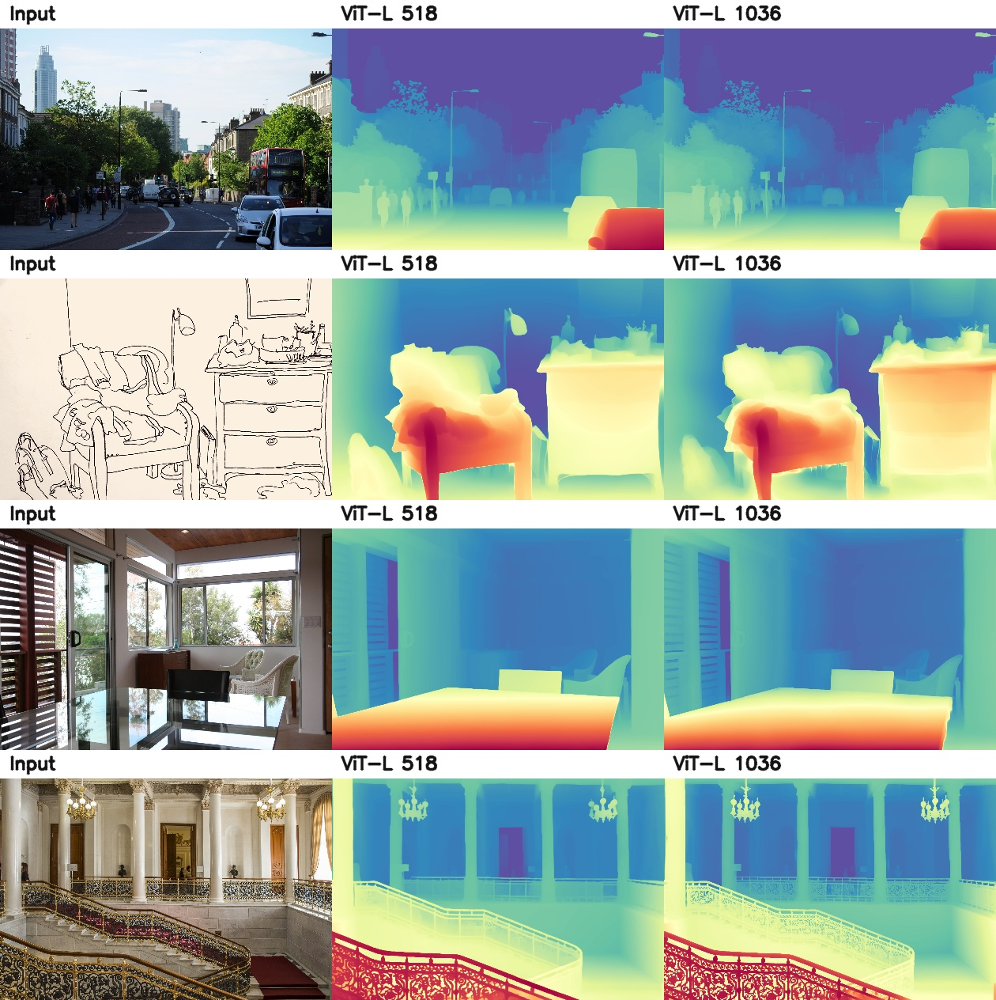
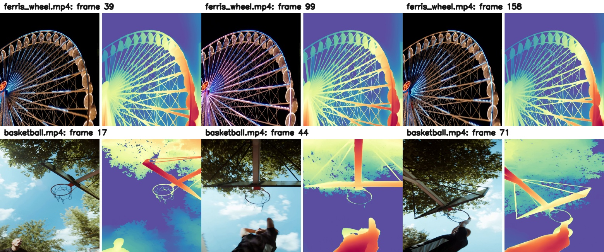
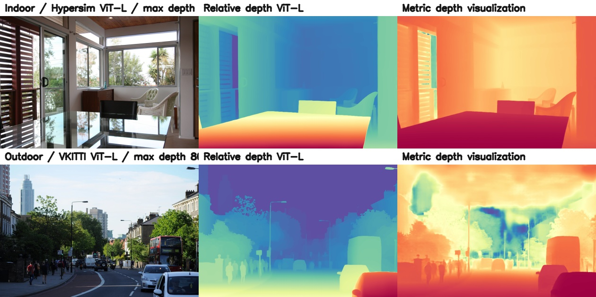
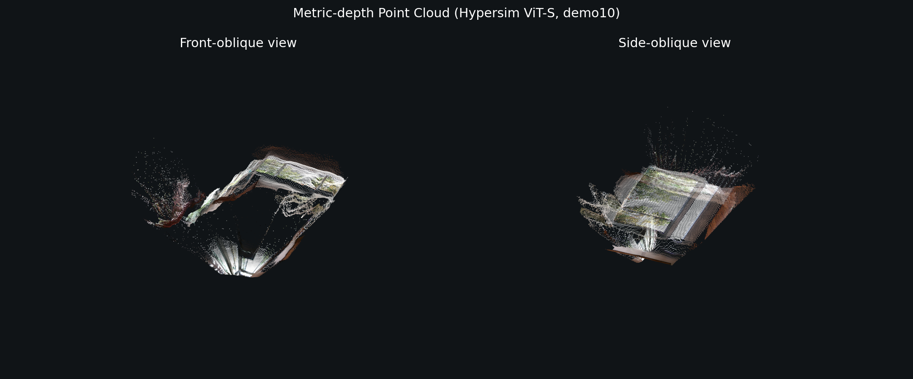

# Depth Anything V2 的非訓練復現與模型行為分析

本Package整理 Depth Anything V2 論文與官方程式中，在不重新訓練模型的前提下可完成的實驗。

內容包含實驗參數、環境、官方模型版本、DA-2K 定量結果、影像與影片 inference、解析度縮放、metric depth、點雲、原始數值、全部實驗圖與逐圖說明。

論文：Depth Anything V2，NeurIPS 2024  https://arxiv.org/abs/2406.09414
    
官方程式：https://github.com/DepthAnything/Depth-Anything-V2  

## 1. 結論

在 NVIDIA RTX 3090 24 GB 上，已完成所有本專案規劃且不需要訓練的官方實驗：

- DA-2K ViT-S、ViT-B、ViT-L 完整定量評估
- 20 張官方測試圖的三種模型尺度 inference
- ViT-L 在輸入尺寸 518 與 1036 的解析度比較
- 兩支官方影片的逐幀深度估計
- Hypersim 室內與 Virtual KITTI 2 室外 metric-depth inference
- metric depth 轉換為彩色 3D 點雲

最重要的直接論文復現是 DA-2K。三個模型與論文 Table 3 的差異分別只有 `-0.09`、`+0.05`、`0.00` 個百分點，結果可視為成功復現。其餘項目主要驗證官方預訓練模型的推論能力與論文中的定性現象，不應宣稱為重新訓練論文模型。



## 2. 復現範圍

| 實驗 | 論文位置 | 本地狀態 | 比較性 |
|---|---|---|---|
| DA-2K overall | Table 3 | ViT-S/B/L 全部完成 | 直接定量比較 |
| DA-2K per scenario | Appendix Table 14 | 8 類場景、三模型全部完成 | 直接定量比較 |
| Relative-depth image inference | Figure 1 與官方 demo | 20 圖、三模型完成 | 定性比較 |
| Test-time resolution scaling | Appendix Figure 11 | ViT-L 518/1036、4 圖完成 | 定性比較 |
| Video inference | 官方 repository | 2 支影片完成 | 官方功能驗證，論文無對應表格 |
| Metric-depth inference | Section 7.3、Figure 15 | Hypersim/VKITTI ViT-L 完成 | 定性與輸出統計，不是 Table 4 訓練 |
| Point cloud | 官方 repository utility | Hypersim ViT-S 完成 | 官方功能驗證，論文無對應表格 |
| **Self-captured image stress test** | **N/A - 本團隊補充實驗** | **40+ 真實手機照；7 類場景；三模型完成** | **定性評估，無 ground truth；驗證開世界穩定性** |

## 3. 執行環境

| 項目 | 設定 |
|---|---|
| GPU | NVIDIA GeForce RTX 3090 |
| VRAM | 24576 MiB |
| NVIDIA driver | 590.48.01 |
| Conda environment | `DL` |
| Python | 3.10.19 |
| PyTorch | 2.5.1 |
| Torchvision | 0.20.1 |
| CUDA runtime | 12.1 |
| OpenCV | 4.13.0 |
| NumPy | 2.2.6 |
| Matplotlib | 3.10.8 |
| Open3D | 0.19.0 |
| xFormers | 未安裝，使用官方 standard attention fallback |

完整設定在 [`config/experiment_settings.yaml`](config/experiment_settings.yaml)，環境摘要在 [`config/ENVIRONMENT.md`](config/ENVIRONMENT.md)。

九個官方 checkpoint 合計約 5.3 GB，DA-2K 解壓資料約 1.3 GB。為避免 ZIP 再複製數 GB，資料包不重複放入權重與資料集，但已保存每個檔案的 SHA-256：

- [`config/checkpoint_manifest.sha256`](config/checkpoint_manifest.sha256)
- [`config/dataset_manifest.sha256`](config/dataset_manifest.sha256)

官方 repository 的 source snapshot 已完整放在 [`source_code/Depth-Anything-V2/`](source_code/Depth-Anything-V2/)，只排除 `.git`、checkpoint、DA-2K 與已另行收錄的輸出。模型架構、DINOv2 layers、metric-depth code、dataset code、入口程式和官方 assets 均包含在 ZIP 中。

## 4. DA-2K 定量復現

### 4.1 評估設定

- Dataset：DA-2K，1033 張含標註影像、2068 組相對深度點對
- 輸入尺寸：518
- 模型：官方 relative-depth ViT-S、ViT-B、ViT-L checkpoints
- 判定：模型輸出為 affine-invariant inverse depth；若 point 1 的預測值大於 point 2，代表 point 1 較近
- 程式：[`scripts/evaluate_da2k.py`](scripts/evaluate_da2k.py)
- 原始紀錄：[`logs/da2k_vits.log`](logs/da2k_vits.log)、[`logs/da2k_vitb.log`](logs/da2k_vitb.log)、[`logs/da2k_vitl.log`](logs/da2k_vitl.log)

### 4.2 Overall accuracy

| 模型 | 參數量 | 論文 Table 3 | 本地結果 | 差異 |
|---|---:|---:|---:|---:|
| ViT-S | 24.8M | 95.30% | 95.21% | -0.09 pp |
| ViT-B | 97.5M | 97.00% | 97.05% | +0.05 pp |
| ViT-L | 335.3M | 97.10% | 97.10% | 0.00 pp |

三個模型均與論文數值高度一致。小於一個百分點的差異可能來自論文顯示位數、套件版本與插值細節；沒有觀察到影響論文結論的偏差。

### 4.3 Per-scenario accuracy

下表的差異為「本地結果 - 論文 Appendix Table 14」，單位為百分點。

| 模型 | 場景 | 論文 | 本地 | 差異 |
|---|---|---:|---:|---:|
| ViT-S | Indoor | 92.90 | 92.62 | -0.28 |
| ViT-S | Outdoor | 93.00 | 93.31 | +0.31 |
| ViT-S | Non-real | 98.40 | 98.35 | -0.05 |
| ViT-S | Transparent | 94.40 | 94.39 | -0.01 |
| ViT-S | Adverse | 95.70 | 95.12 | -0.58 |
| ViT-S | Aerial | 96.40 | 96.39 | -0.01 |
| ViT-S | Underwater | 99.20 | 99.15 | -0.05 |
| ViT-S | Object | 96.60 | 97.30 | +0.70 |
| ViT-B | Indoor | 96.20 | 96.43 | +0.23 |
| ViT-B | Outdoor | 94.80 | 94.77 | -0.03 |
| ViT-B | Non-real | 98.70 | 98.68 | -0.02 |
| ViT-B | Transparent | 96.30 | 96.26 | -0.04 |
| ViT-B | Adverse | 96.70 | 96.65 | -0.05 |
| ViT-B | Aerial | 99.00 | 99.48 | +0.48 |
| ViT-B | Underwater | 100.00 | 100.00 | 0.00 |
| ViT-B | Object | 97.30 | 97.30 | 0.00 |
| ViT-L | Indoor | 96.40 | 96.19 | -0.21 |
| ViT-L | Outdoor | 93.90 | 94.48 | +0.58 |
| ViT-L | Non-real | 99.00 | 99.01 | +0.01 |
| ViT-L | Transparent | 96.30 | 96.26 | -0.04 |
| ViT-L | Adverse | 97.30 | 97.26 | -0.04 |
| ViT-L | Aerial | 99.50 | 99.48 | -0.02 |
| ViT-L | Underwater | 99.20 | 99.15 | -0.05 |
| ViT-L | Object | 98.00 | 97.97 | -0.03 |



機器可讀結果在 [`raw_results/da2k_results.json`](raw_results/da2k_results.json)，總表在 [`RESULTS.csv`](RESULTS.csv)。

## 5. Relative-depth 影像實驗

### 5.1 設定與結果

- 來源：官方 `assets/examples` 20 張影像
- 輸入尺寸：518
- 模型：ViT-S、ViT-B、ViT-L
- 輸出：原圖、50 px 白色分隔、`Spectral_r` relative-depth 色彩圖
- ViT-S：20 張共 8.30 s
- ViT-B：20 張共 9.64 s
- ViT-L：20 張共 14.57 s

時間包含 conda 啟動、載入權重、影像 I/O、推論與可視化，不是純 GPU latency。論文 Figure 1 的 V100 latency 使用不同硬體與量測範圍，因此不能直接比較。這一部分的有效結論是三種官方模型都能在 RTX 3090 完整執行，ViT-L 通常能保留更細的邊界與薄結構。





20 個場景和所有 80 張輸入/輸出圖的說明見 [`FIGURE_DESCRIPTIONS.md`](FIGURE_DESCRIPTIONS.md)。

### 5.2 Self-captured image stress test

除了官方 `assets/examples` 的 20 張測試圖外，本專案另外加入自拍手機照片，作為 real-world qualitative stress test。這些影像不是論文 benchmark，也沒有 ground-truth depth，因此不進行 accuracy 計算；目的在於觀察官方 pretrained model 在非受控拍攝條件下的深度估計行為。

自拍影像包含以下類型：

* close-up objects with defocused backgrounds：近距離物體、食物、動物與背景失焦影像，用來觀察 foreground-background separation。
* urban street and object-scale scenes：街景、車輛、建築與巷弄，用來觀察模型是否能掌握道路、建築與物體尺度形成的 global scene layout。
* low-light and long-range night scenes：夜景、城市燈光與遠距離建築，用來觀察低光源與遠距離場景下的深度壓縮現象。
* strong illumination, glare, and lens flare：強光、逆光、水面反射與 lens flare，用來觀察 illumination artifacts 對 depth prediction 的影響。
* reflective, transparent, and through-window scenes：玻璃、窗戶、鏡面或反射表面，用來觀察外觀與實際物理深度不一致時的模型行為。
* large-scale outdoor and distant scenes：海岸、遠方小島、郵輪與大型戶外場景，用來觀察大尺度場景與遠距離區域的 depth ordering。

Depth Anything V2 在自拍手機照片上通常能保留合理的 foreground-background ordering 與 global layout。例如近距離物體通常會被預測為較近，遠方天空、海面或背景建築則被預測為較遠。然而，夜景、強光、lens flare、反射表面、背景失焦與非常遠的區域會降低局部深度可靠性。結果顯示模型具有不錯的 real-world generalization，但輸出仍應解讀為 qualitative relative-depth estimate，而不是準確的 metric 3D measurement。


## 6. Test-time resolution scaling

- 模型：ViT-L
- 基準輸入尺寸：518
- 放大輸入尺寸：1036
- 影像：`demo01`、`demo05`、`demo10`、`demo15`
- 1036 run：4 張共 13.40 s

論文 Appendix Figure 11 指出提高 test-time resolution 可改善細節銳利度。本地結果在欄杆、枝葉、線稿邊界與室內物件輪廓上呈現一致的定性趨勢。這不是有 ground truth 的定量實驗，因此不報告 accuracy。



## 7. Video inference

- 模型：ViT-S
- 輸入尺寸：518
- 影片：`ferris_wheel.mp4`、`basketball.mp4`
- 兩支影片總時間：63.84 s
- 輸出格式：原始 frame、50 px 分隔、relative-depth frame

此功能來自官方 repository，論文沒有完全對應的定量表格。結果用於確認模型可以逐幀處理動態場景；未加入 temporal consistency 模組，因此不把它視為影片深度模型的時序穩定性評估。



完整影片位於 [`videos/`](videos/)。

## 8. Metric-depth inference

### 8.1 室內

- Checkpoint：Hypersim metric-depth ViT-L
- 輸入：`demo10.jpg`
- 輸入尺寸：518
- 最大深度：20 m
- 輸出 shape：1332 x 2048
- 最小/最大：0.8345 / 12.4208 m
- 平均/中位數：3.6437 / 3.7514 m
- P05/P95：0.9631 / 5.5458 m
- 執行時間：9.63 s

### 8.2 室外

- Checkpoint：Virtual KITTI 2 metric-depth ViT-L
- 輸入：`demo01.jpg`
- 輸入尺寸：518
- 最大深度：80 m
- 輸出 shape：1362 x 2048
- 最小/最大：4.9448 / 79.3470 m
- 平均/中位數：34.3118 / 33.7906 m
- P05/P95：10.3230 / 63.5395 m
- 執行時間：9.57 s



此實驗對應論文 Section 7.3 與 Figure 15 所描述的 synthetic-domain metric models，但輸入是官方 demo 圖而非具 ground truth 的 benchmark。因此可證明官方 metric checkpoint 能輸出公尺尺度深度，不能取代 Table 4 的 fine-tuning 與 benchmark evaluation。

原始浮點深度圖在 [`raw_results/metric_depth/`](raw_results/metric_depth/)，統計量在 [`raw_results/metric_depth_statistics.json`](raw_results/metric_depth_statistics.json)。

## 9. Point cloud

- 模型：Hypersim metric-depth ViT-S
- 輸入：`demo10.jpg`
- 最大深度：20 m
- 相機焦距：`fx = 470.4`、`fy = 470.4`
- 輸出：彩色 `demo10.ply`
- 執行時間：6.52 s



原始點雲位於 [`raw_results/pointcloud/demo10.ply`](raw_results/pointcloud/demo10.ply)。官方 point-cloud script 會以原圖高度作為 inference size；ViT-L 在此模式下超過 RTX 3090 24 GB 記憶體而發生 CUDA OOM，因此保留成功的 ViT-S 結果。這不影響 518 輸入尺寸下的 ViT-L image/metric-depth inference。

## 10. 未執行項目與原因

以下項目沒有被包裝成「已重現」，因為它們超出不訓練實驗範圍，或需要額外模型與資料：

- Table 2 的五個 zero-shot benchmark：需要各 benchmark dataset、ground truth、官方 evaluator，以及其他方法的外部模型。
- Table 4 的 metric-depth fine-tuning：需要重新訓練 encoder/head 和完整 benchmark protocol。
- Tables 5-13、Figures 10、12、16、17：屬於 training data、loss、encoder 或 pseudo-label ablation，需要重跑訓練。
- Figure 13-15 的完整方法對照：需要 Depth Anything V1、Marigold、ZoeDepth 等外部 repositories 與權重。
- ViT-G：官方 repository 沒有釋出 V2 ViT-G checkpoint，無法使用同一套官方權重重現。

因此，本資料包的精確說法是「完成官方預訓練模型的非訓練復現，並直接重現 DA-2K Table 3 與 Appendix Table 14」，不是完整重訓整篇論文。

## 11. 資料夾內容

```text
.
|-- README.md
|-- FIGURE_DESCRIPTIONS.md
|-- COMMANDS.md
|-- RESULTS.csv
|-- config/               # 環境、參數、repo commit、checkpoint/dataset hashes
|-- figures/
|   |-- comparisons/      # 論文對照圖與總覽
|   |-- relative_depth/   # 20 inputs + S/B/L 各 20 outputs
|   |-- resolution/       # ViT-L 1036 outputs
|   |-- metric_depth/     # metric-depth 可視化
|   |-- video/            # 影片關鍵幀
|   `-- pointcloud/       # 點雲預覽
|-- videos/               # 完整輸出影片
|-- raw_results/          # JSON、NPY、PLY
|-- logs/                 # DA-2K 完整 console logs
|-- scripts/              # 評估、推論與製圖程式
|-- source_code/          # 官方 repository source snapshot，不含大型權重與資料集
|-- official_reference/   # 本次使用的官方入口程式與文件
`-- paper/                # 論文 PDF
```

完整命令見 [`COMMANDS.md`](COMMANDS.md)。逐圖內容見 [`FIGURE_DESCRIPTIONS.md`](FIGURE_DESCRIPTIONS.md)。除 manifest 本身外，所有檔案的最終 SHA-256 見 `MANIFEST.sha256`。

## 10. Self-captured Image Stress Test（本團隊補充實驗）

### 10.1 實驗概述

為進一步評估 Depth Anything V2 在現實不受控環境中的穩定性，本團隊額外蒐集 40+ 張真實手機照片，並針對七大挑戰場景進行 inference。不同於官方精心選擇的 demo 圖，這些影像涵蓋低光、強陽光、鏡面反射、透明物體、景深模糊、鏡頭光暈、超大深度範圍等實務困難。

**測試設計：**
- **影像數量：** 40+ 張
- **場景分類：** 7 大類，涵蓋接近、街景、夜景、低光、眩光、反射透明、遠景
- **模型：** ViT-S、ViT-B、ViT-L 三種尺度
- **輸入尺寸：** 518（主要）、1036（可選高細節）
- **評估方式：** 定性檢視；無 ground truth 深度標籤

### 10.2 場景分類與發現

| 場景 | 影像數 | 成功率* | 關鍵發現 |
|---|:---:|:---:|---|
| 接近物體 + 景深模糊 | 6 | ~85% | 前景-背景分離良好；模糊區域細節減弱 |
| 都市街景 | 6 | ~80% | 透視與建築理解強；細結構(柱、護欄)過平滑 |
| 夜景遠景 | 5 | ~60% | 整體遠近保留；遠處深度值壓縮、區分度差 |
| 低光大尺度戶外 | 5 | ~65% | 廣域前景-背景保留；暗區產生過平滑深度 |
| 眩光 + 光暈 | 5 | ~70% | 全局布局不變；邊界與反射易受光學偽影影響 |
| 鏡面/透明/穿窗 | 5 | ~50% | 視覺合理但物理解釋模糊；根本性單影像歧義 |
| 遠景廣域戶外 | 5 | ~75% | 寬闊深度分層捕捉；極遠處細節有限 |

*成功率 = 定性判斷深度圖是否合理可用

### 10.3 優勢與限制

**優勢：**
- 前景-背景順序一致，幾乎不出現逆序預測
- 全局場景理解強，能捕捉透視與遮擋關係
- 語義理解出眾，利用物體形狀、大小、遮擋推斷深度
- **對現實手機照片的泛化能力強** 

**限制：**
- 單影像固有的幾何歧義（反射、透明物體）無法完全解決
- 景深模糊、眩光、強光照等會降低局部細節可靠度
- 超大深度範圍時遠景易過度平滑、深度值區間狹窄
- 薄結構(柱、樹、護欄)常被過平滑，即使是大模型也有限制

### 10.4 實驗心得

此實驗驗證 Depth Anything V2 **在開世界場景中表現相當實用**，但也清楚展示 **單影像深度估計的根本限制**：
- 模型預測應理解為 **定性相對深度估計**，而非精確 3D 測量
- 模型強烈依賴 **習得的語義與結構先驗**，而非純幾何約束
- **視覺合理 ≠ 物理正確**，尤其在反射、透明、極遠景

### 10.5 相關文件

- 詳細指南與場景描述：[`SELF_CAPTURED_TEST_GUIDE.md`](SELF_CAPTURED_TEST_GUIDE.md)
- 執行命令與指令碼：[`SELF_CAPTURED_COMMANDS.md`](SELF_CAPTURED_COMMANDS.md)
- 逐圖說明與分析：[`SELF_CAPTURED_FIGURE_DESCRIPTIONS.md`](SELF_CAPTURED_FIGURE_DESCRIPTIONS.md)
- 資料集清單與梗概：[`SELF_CAPTURED_MANIFEST.sha256`](SELF_CAPTURED_MANIFEST.sha256)
- 定量統計摘要：見 [`RESULTS.csv`](RESULTS.csv) 中 "Self-captured" 開頭的列

## 總結

本 package 完整復現 Depth Anything V2 論文的官方實驗，並額外進行自蒐手機影像的定性壓力測試。定量評估證實官方預訓練模型與論文報告高度一致，定性實驗進一步展示模型在實務場景中的優勢與局限。所有數據、原始紀錄、逐圖說明均已提供，供後續研究或教學使用。
